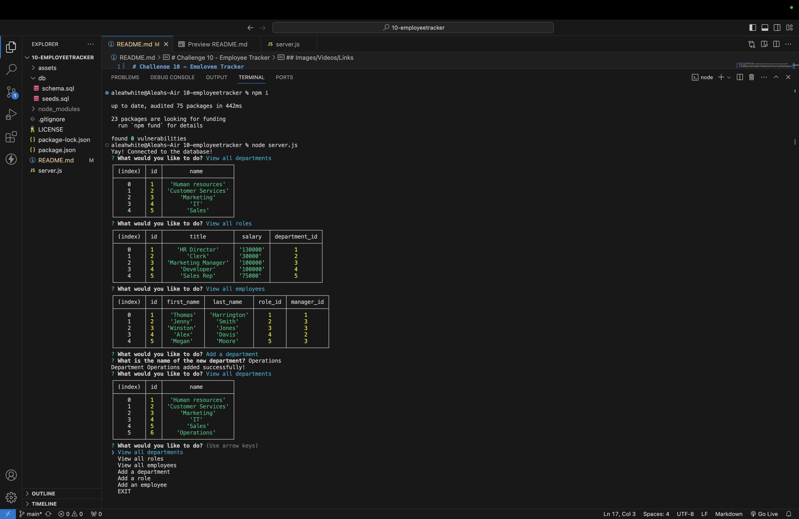

# Challenge 10 - Employee Tracker
 
  ## Description
  it is a command line application written in JavaScript/SQL and uses Node.js on your integrated terminal to run it. This application uses a database I have created with tables to view/add employees, roles and departments on the employee_info_db. This app is called a content management system (CMS) and helps companies manage their data on employees.
  
  ## Table of Contents 
  - [Usage](#usage)

  - [Credits](#credits)

  - [Questions](#questions)

  - [License](#license)

  ## Images/Videos/Links
  
  [Link to walk-through video.](https://drive.google.com/file/d/123Xg3vwYZsR89De6WM2CeCSFKloRXqXk/view?usp=sharing)

  ## Usage
  Before using this application, you want to make sure you have Node.js installed on the local machine you will be running it on. If you have Node.js installed, you can use this application by cloning this repository to a folder of your choice, then cd-ing to '10-employeetrackers'(or what you named my repository you cloned). Once onto the repository, use 'code' command to open VSCode (If you don't have the code path installed, manually open VSCode and find the repo in the folder you chose). After you have the file open in VSCode, right-click on the folder and open the integrated terminal. Now to the fun part! In the Integrated terminal run 'npm i' to install the inquirer that's needed. Then run 'node server.js' in the terminal. You will see 7 choices to choose, from viewing roles to adding a new employee. This app is the perfect way to organize your company/employee data. If you need a visual step-by-step then [click here](https://drive.google.com/file/d/123Xg3vwYZsR89De6WM2CeCSFKloRXqXk/view?usp=sharing) for the tutorial video!

  ## Credits
  [W3 Schools]()

  ## Questions
  If you have any questions/comments about the project, you can email me at [aleahwhite55@gmail.com](mailto:aleahwhite55@gmail.com). For more of my work you can visit my GitHub at [aleahwhite](https://github.com/aleahwhite).

  ## License
  
  This project is licensed under the MIT license. For more information, see the [license page](https://spdx.org/licenses/MIT.html).

  